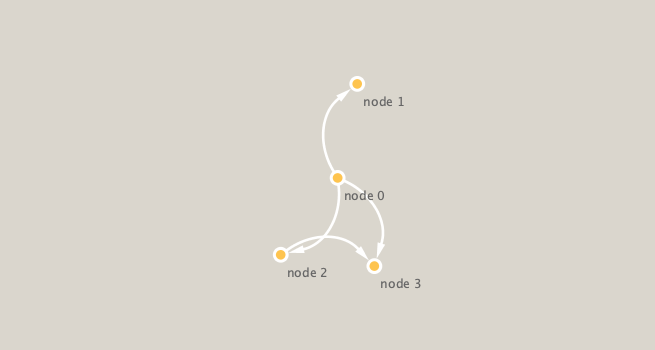

```{r setup, include=FALSE}
knitr::opts_chunk$set(echo = TRUE)
```

```{r}
library(RCy3)

# Test the connection to Cytoscape.
cytoscapePing()
```

```{r}
# Check the version
cytoscapeVersionInfo()

```

```{r}
library(igraph)

g <- makeSimpleIgraph()
createNetworkFromIgraph(g,"myGraph")
```

```{r}
fig <- exportImage(filename="demo", type="png", height=350)
```


```{r}

```

```{r}
setVisualStyle("Marquee")
```

```{r}
styles <- getVisualStyleNames()
styles
```

```{r}
setVisualStyle(styles[18])
```

```{r}
## scripts for processing located in "inst/data-raw/"
prok_vir_cor <- read.delim("virus_prok_cor_abundant.tsv", stringsAsFactors = FALSE)

## Have a peak at the first 6 rows
head(prok_vir_cor)
```
How many connections (i.e., edges) will we have in our network - lets look at the number of rows.
```{r}
nrow(prok_vir_cor)
```

Use the igraph function to make a network for this data.frame:
```{r}
g <- graph.data.frame(prok_vir_cor, directed = FALSE)
class(g)
g
```


```{r}
plot(g)
```

This default plot is a hot mess! Lets turn of the blue text labels

```{r}
plot(g, vertex.label=NA)
```

The nodes/vertex are too big. Lets make them smaller…

```{r}
plot(g, vertex.size=3, vertex.label=NA)
```


```{r}
library(ggraph)
ggraph(g, layout = 'auto') +
  geom_edge_link(alpha = 0.25) +
  geom_node_point(color="steelblue") +
  theme_graph()
```

To send this network to Cytoscape we can use the command:

```{r}
createNetworkFromIgraph(g,"myIgraph")
```


```{r}
V(g)
```

## Network community detection

Let's cluster our network to find "community" structure..

Community structure detection algorithms try to find dense sub-graphs within larger network graphs (i.e. clusters of well connected nodes that are densely connected themselves but sparsely connected to other nodes outside the cluster) . Here we use the classic Girvan & Newman betweenness clustering method. The igraph package has lots of different community detection algorithms (i.e. different methods for finding communities).

```{r}
cb <- cluster_edge_betweenness(g)
plot(cb, y=g, vertex.label=NA,  vertex.size=3)
```

## Centrality analysis

Centrality gives an estimation on how important a node or edge is for the connectivity (or the information flow) of a network. It is a particularly useful parameter in signaling networks and it is often used when trying to find drug targets for example.

Centrality analysis often aims to answer the following question: Which nodes are the most important and why?

```{r}
pr <- page_rank(g)
head(pr$vector)
```

Lets plot our network with nodes size scaled via this page rank centrality scores.


